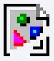

# Your first day

:city_sunrise: :sparkles: \[High quality photo of people welcoming you to the organization. Include five people of varying cultures and ethnicities (including one of the current employee), mildly smiling. Standing in front of the office near the edge of the forest in a peacetime office stance. Do not include likenesses of famous people or those who have previously worked for the organization. Panoramic size.\]

Congratulations on joining our organization! We're thrilled to provide you with a unique set of tools and items to enhance your work experience from day one. Get ready to imagine harder!

| :sparkles: Thank you for installing MemoMore, your digital 3rd place. All discussions (and arguments and other markup) are automatically included inline to your View™.    Note: your organizational twin will not have access to MemoMore data unless you copy it into the organizational context.    See our [Terms of Service](#) for more information on what is protected and anonymized from your organization.  |
|:---|

## :information_desk_person: Why was this generated? 

This section is designed to ensure that new employees feel welcomed and empowered from the moment they step into the organization. The inclusion of unique and symbolic items in the welcome kit aims to foster a culture of creativity and individuality. If there's anything specific you'd like to add or modify, please give us feedback below.

## Receiving Your Imagineer Welcome Kit

:city_sunrise: :sparkles: \[Archive photo of the last welcome to be sent out. Remove any identifiable people from the picture\]

* Collection Point: Retrieve your welcome kit from the reception or designated area.
* Kit Contents: Your kit includes a security key with a Work Randomizer feature, a versatile earbud, a desk communicator, a Smell of Imagination diffuser, a First Day Machete, and an Imagine Harder hat.

## Setting Up Your Workspace

* Desk Speaker Installation: Follow the easy steps in the provided manual to set up your desk speaker for optimal sound quality.
* Smell of Imagination Diffuser: Set up the diffuser by following the instructions and start with the default Smell of Imagination to stimulate creativity.

## Integrating Your Security Key and Randomizer Device

* Activation: Instructions on how to activate and use your security key for both security and the work randomizer function. 
* Inspiration through Randomization: Utilize the randomizer to challenge your conventional thinking and foster creative solutions. Try it out now to ask what you should do next. What does it say? Do that!

## Earbud and Imagine Harder Hat

* Earbud Usage: Guidelines on how to use the provided earbud or integrate your personal one with our systems. IT requires a fresh neural calibration when pairing your own (otherwise it is automatically done with the one from us). 
Hat Adjustment and Exchange: Steps to adjust your Imagine Harder hat for comfort. If the size is wrong, instructions on how to exchange it at a local swag locker. [🗣see controversy](#)

--- Start MemoMore content ---

MemoMore discussions ↗:

* [First impressions aren’t what they seem with your digital twins](#)
* [Digital twin disagreed with my intro video and said it wasn’t authentic!](#)
* [My twin is better than me?!](#)

Warning: all MemoMore discussions are not protected under your [employment agreement](#) and are handled through [MemoMore ToS](#). Uninstall this plug-in to be compliant.

--- End MemoMore content ---
